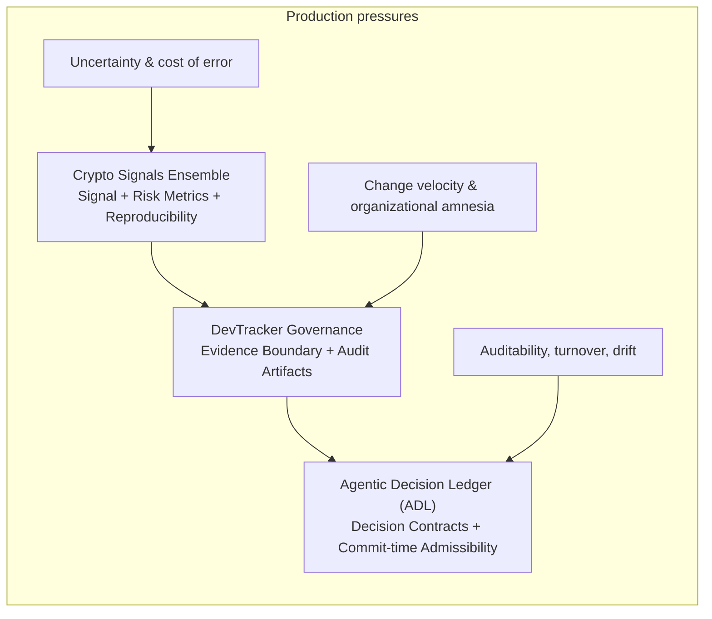

# Governed AI Portfolio — Admission Control for Agentic Change

> **Positioning:** control-plane architecture for AI / agentic systems, focused on admissibility, auditability, and governance-by-construction.

---

## What this portfolio is (and is not)

> [!IMPORTANT]
> This is **not** a projects gallery.  
> It is a **coherent professional trajectory** showing how responsibility escalates from signal → change governance → decision admissibility.

**This portfolio is:**
- A landing page for Staff / Principal / Architect hiring loops.
- A set of **falsifiable claims** backed by inspectable artifacts.
- A fast path to evaluate real-world governance and model-risk thinking.

**This portfolio is not:**
- a SaaS pitch,
- a hype deck,
- a promise of safe autonomy by default,
- a replacement for organizational responsibility.

---

## The trajectory (coherent, not parachuted)

My path is deliberate and cumulative:

**Economics → Risk management → Econometrics → Applied ML → Crypto decision systems → Change governance → Decision admissibility**

Why this matters:
- Economics and risk force explicit treatment of uncertainty and incentives.
- Econometrics and ML expose drift, fragility, and overfitting.
- Crypto decision systems impose real cost of error and reproducibility discipline.
- Governance emerges naturally when scale, turnover, and time enter the system.

### Anchor repositories

1) **Crypto Signals Ensemble**  
Signal extraction, uncertainty management, and risk metrics under real cost of error.  
https://github.com/lexseasson/crypto_signals_ensemble

2) **DevTracker Governance**  
Governance as admission control for change; evidence boundary and audit artifacts.  
https://github.com/lexseasson/devtracker-governance

3) **Agentic Decision Ledger (ADL)**  
Decision contracts and commit-time admissibility (**Decision ≠ Log**).  
https://github.com/lexseasson/agentic-decision-ledger

---
## Systems map (high-level)

## The hook (what breaks in real organizations)

Agentic systems fail when:
- change ships without admissibility,
- automation overwrites meaning (semantics),
- evidence is missing when incidents happen,
- responsibility is ambiguous (“who approved this?”).

> **Thesis:** Governance is not bureaucracy — it is admission control for change.

---

## What is actually senior here (signals that matter)

This portfolio is optimized for concerns that appear in Staff / Principal / Architect loops:

- **Boundaries:** who owns semantics vs who writes evidence.
- **Failure modes:** post-incident defensibility, drift, turnover survivability.
- **Trade-offs:** commit-time friction to reduce forensic cost later.
- **Non-goals:** refusal to ship “magic autonomy” without controls.
- **Integration realism:** CI gates and artifact retention as part of delivery.

See:
- `docs/04_ARCHITECTURE_AND_INNOVATION.md`
- `docs/05_THREAT_MODEL.md`
- `docs/07_INTEGRATION_PATTERNS.md`

---

## How to evaluate (fast)

Start here:
1) `docs/01_HIRING_MANAGER_TLDR.md` (≈ 90 seconds)
2) `docs/02_15MIN_EVAL_PLAYBOOK.md` (exact route)
3) `docs/08_EVIDENCE_PACK.md` (clickable proof)

If you only click one thing:  
**Open `docs/08_EVIDENCE_PACK.md` and follow the pointers to real artifacts.**

---

## Role fit (explicit)

- AI Governance Architect  
- Responsible AI Architect  
- AI Risk Management / Model Risk AI  
- LLM / Agentic Systems Architect  
- Staff / Principal Platform Engineer (AI control-plane)

See:
- `docs/03_SYSTEMS_MAP.md`
- `docs/04_ARCHITECTURE_AND_INNOVATION.md`

---

## Non-goals (to prevent tool sprawl)

- This portfolio is not a full MLOps suite.
- DevTracker is not a project management replacement.
- ADL is not a workflow engine; it is an admissibility layer.
- Observability alone is not governance.

---

## How to use this in an interview

Ask:
- What change would you block, and why?
- Where does the decision live, and who owns it over time?
- What evidence would you want two weeks after an incident?

This repository exists so those questions have **inspectable, non-hand-wavy answers**.
