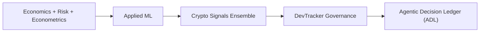
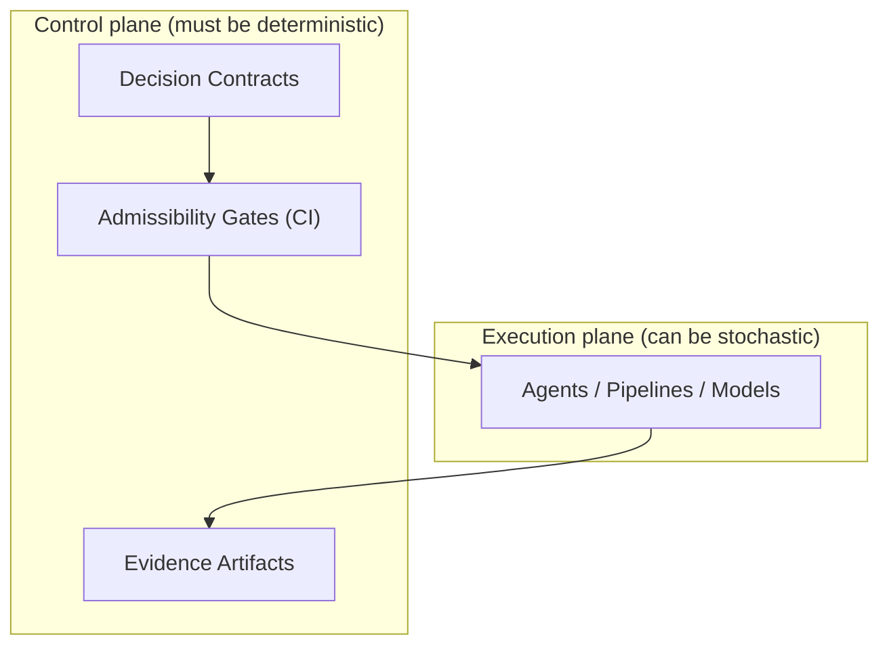

# Systems Map — Architecture & Responsibility

## One-line summary

This portfolio demonstrates a progression from **quantitative decision-making** to **change governance** to **decision admissibility**.

It is a map of **responsibility escalation**, not feature accumulation.

---

## Diagram 1 — Career and system trajectory


Interpretation:
Each step introduces a new constraint:
economics → incentives,
ML → drift,
crypto → real cost of error,
governance → responsibility over time,
ADL → admissibility before action.

## Diagram 2 — Control plane vs execution plane

Key point:
Autonomy belongs in execution.
Responsibility belongs in the control plane.

## Diagram 3 — Repository responsibility split
mermaid``` 
flowchart LR
  subgraph Repo1["Crypto Signals Ensemble"]
    R1a["Signal extraction"]
    R1b["Risk metrics"]
    R1c["Reproducibility"]
  end

  subgraph Repo2["DevTracker Governance"]
    R2a["Evidence boundary"]
    R2b["Audit reports"]
    R2c["Machine snapshots"]
  end

  subgraph Repo3["Agentic Decision Ledger (ADL)"]
    R3a["Decision contracts"]
    R3b["Admissibility checks"]
    R3c["CI gates"]
  end

  Repo1 --> Repo2 --> Repo3

```

Interpretation:
Signals inform change.
Change requires evidence.
Decisions require admissibility.

Why this matters

Most agentic failures are not model failures.
They are organizational memory failures.

This map makes responsibility explicit, inspectable, and enforceable.